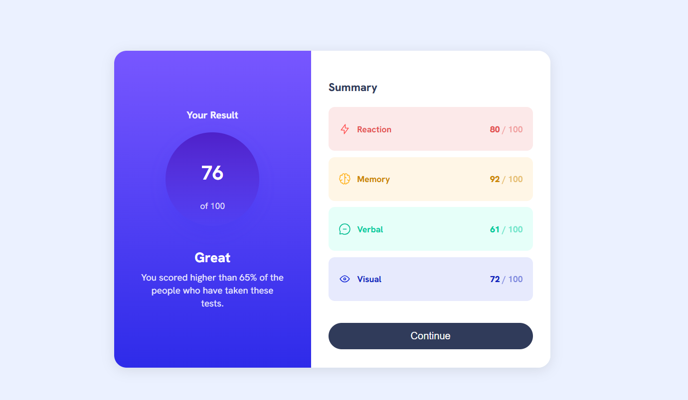

# Frontend Mentor - Results summary component solution

This is a solution to the [Results summary component challenge on Frontend Mentor](https://www.frontendmentor.io/challenges/results-summary-component-CE_K6s0maV).  
Frontend Mentor challenges help you improve your coding skills by building realistic projects.

---

## Table of contents

- [Overview](#overview)
  - [The challenge](#the-challenge)
  - [Screenshot](#screenshot)
  - [Links](#links)
- [My process](#my-process)
  - [Built with](#built-with)
  - [What I learned](#what-i-learned)
  - [Continued development](#continued-development)
- [Author](#author)

---

## Overview

### The challenge

Users should be able to:

- View the optimal layout for the interface depending on their device's screen size
- See hover states for interactive elements
- Display a clear summary of scores in a clean, accessible layout

### Screenshot

### Links

- Solution URL: [Frontend Mentor Solution](https://www.frontendmentor.io/)
- Live Site URL: https://aarytadwalkar.github.io/results-summary-component/

---

## My process

### Built with

- Semantic HTML5 markup
- CSS Flexbox
- CSS custom properties
- Desktop-first layout
- Google Fonts (Hanken Grotesk)

### What I learned

This project helped me strengthen my understanding of layout building using **Flexbox** and improve attention to spacing, alignment, and visual hierarchy.

I also learned:
- How to structure components cleanly using semantic HTML
- How to manage relative paths correctly for deployment on GitHub Pages
- How small CSS details (padding, border-radius, gradients) significantly improve UI quality

### Continued development

In future projects, I would like to:
- Improve responsiveness further with mobile-first breakpoints
- Refactor CSS for better reusability and scalability
- Use JavaScript to dynamically populate the summary data from `data.json`

---

## Author

- GitHub: [AaryTadwalkar](https://github.com/AaryTadwalkar)
- Frontend Mentor: [@AaryTadwalkar](https://www.frontendmentor.io/profile/AaryTadwalkar)
